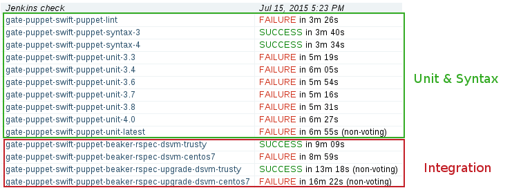

How does it work ?
==================
In a nutshell
-------------
WeIRDO is a collection of Ansible roles_ and playbooks_.

WeIRDO, through Ansible_, will:

- Connect to a node specified in it's inventory (this can be a remote node or
  localhost)
- Generate a similar environment to the gate (setup configuration, packages,
  dependencies)
- Run the gate job (i.e, ``run_tests.sh`` or ``tox`` provided by the upstream
  project)

WeIRDO, by itself, doesn’t use or require Jenkins. When run inside a job,
however, it will be able to report success or failure.

Details on how the Jenkins jobs are configured is available here_.

.. _roles: http://weirdo.readthedocs.org/en/latest/roles.html
.. _playbooks: http://weirdo.readthedocs.org/en/latest/playbooks.html
.. _Ansible: http://www.ansible.com/
.. _here: http://weirdo.readthedocs.org/en/latest/jenkins-job-configuration.html

Example: Puppet-Openstack
-------------------------
Puppet-Openstack_ gates every commit that is done with syntax, unit and
integration tests.

These tests ensure there is no regression when someone contributes to one of
the many modules involved in Puppet-Openstack.

While the `syntax and unit`_ checks are supplied by each respective puppet
module, the integration tests are provided through the
puppet-openstack-integration_ project.
Ultimately, these are all configured to run by Jenkins through project-config_
and are triggered when a patchset is submitted to Gerrit.

The integration tests are of particular interest since the puppet modules will
install OpenStack libraries, clients and services with the packages provided
through RDO_. Tempest is currently the only exception and is installed from
source.

Puppet-Openstack uses these integration tests to ensure their puppet modules
work well.

WeIRDO leverages these integration tests to ensure that the packages provided
by RDO work well.

.. _Puppet-Openstack: http://docs.openstack.org/developer/puppet-openstack-guide/
.. _puppet-openstack-integration: https://github.com/openstack/puppet-openstack-integration
.. _syntax and unit: https://github.com/openstack/puppet-nova/blob/master/Rakefile
.. _project-config: https://github.com/openstack-infra/project-config
.. _RDO: https://www.rdoproject.org/

Test implementation
~~~~~~~~~~~~~~~~~~~
This is what the WeIRDO implementation looks like for puppet-openstack:

.. graphviz::

    digraph {
      a  [shape = polygon, sides = 4,label = <Install base common packages (wget, development tools, etc.) <I>playbooks/roles/common/tasks/packages</I>>]
      b  [shape = polygon, sides = 4,label = <Setup trunk repositories (i.e, trunk.rdoproject.org) <I>playbooks/roles/common/tasks/repositories</I>>]
      c  [shape = polygon, sides = 4,label = <Install project's test dependencies (ruby-devel, rubygems, etc.) <I>playbooks/roles/puppet-openstack/tasks/packages</I>>]
      d  [shape = polygon, sides = 4,label = <Clone puppet-openstack-integration <I>playbooks/roles/puppet-openstack/tasks/setup</I>>]
      e  [shape = polygon, sides = 4,label = <Execute run_tests.sh (with scenario001, scenario002, etc.) <I>playbooks/roles/puppet-openstack/tasks/run</I>>]
      f  [shape = polygon, sides = 4,label = <Install puppet, puppet modules <I>run_tests.sh</I>>]
      g  [shape = polygon, sides = 4,label = <Deploy OpenStack <I>run_tests.sh: puppet apply fixtures/scenario00X.pp</I>>]
      h  [shape = polygon, sides = 4,label = <Run Tempest smoke <I>run_tests.sh: cd tempest; tox -eall -- --concurrency=2 smoke dashboard</I>>]
      i  [shape = polygon, sides = 4,label = <Collect project's logs (with copy_logs.sh) <I>playbooks/roles/puppet-openstack/tasks/logs</I>>]
      j  [shape = polygon, sides = 4,label = <Collect and centralize additional logs <I>playbooks/roles/common/tasks/logs</I>>]

      subgraph cluster_0 {
        label = "WeIRDO";
        style = "dashed";
        a -> b -> c -> d -> e;
      }

      subgraph cluster_1 {
        label = "puppet-openstack-integration";
        style = "dashed";
        e -> f -> g -> h;
      }

      subgraph cluster_2 {
        label = "WeIRDO";
        style = "dashed";
        h -> i -> j;
      }
    }
