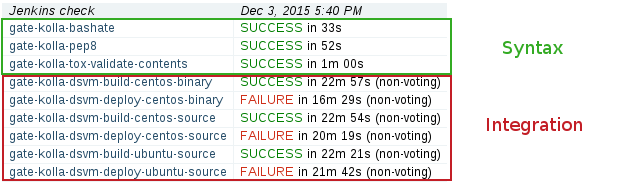

How does it work ?
==================
In a nutshell
-------------
WeIRDO is a collection of Ansible roles_ and playbooks_.

WeIRDO, through Ansible_, will:

- Create an ephemeral node on which the CI job will be run
- Generate a similar environment to the gate (setup configuration, packages,
  dependencies)
- Run the gate job (i.e, ``run_tests.sh`` or ``tox`` provided by the upstream
  project)
- Destroy the ephemeral environment

This is not unlike what the Openstack Infra team is already doing with Jenkins
and NodePool_ - and with good reason. We don’t want to be too different than
the gate to involve as little implementation effort as possible.

WeIRDO, by itself, doesn’t use or require Jenkins. When run inside a job,
however, it will be able to report success or failure.

Details on how the Jenkins jobs are configured is available here_.

.. _roles: http://weirdo.readthedocs.org/en/latest/roles.html
.. _playbooks: http://weirdo.readthedocs.org/en/latest/playbooks.html
.. _Ansible: http://www.ansible.com/
.. _NodePool: http://docs.openstack.org/infra/system-config/nodepool.html
.. _here: http://weirdo.readthedocs.org/en/latest/jenkins-job-configuration.html

Puppet-Openstack
----------------
Puppet-Openstack_ gates every commit that is done with syntax, unit and
integration tests.

.. image:: images/puppet-openstack.png

These tests ensure there is no regression when someone contributes to one of
the many modules involved in Puppet-Openstack.

While the `syntax and unit`_ checks are supplied by each respective puppet
module, the integration tests are provided through the
puppet-openstack-integration_ project.
Ultimately, these are all configured to run by Jenkins through project-config_
and are triggered when a patchset is submitted to Gerrit.

The integration tests are of particular interest since the puppet modules will
install OpenStack libraries, clients and services with the packages provided
through RDO_. Tempest is currently the only exception and is installed from
source.

Puppet-Openstack uses these integration tests to ensure their puppet modules
work well.

WeIRDO leverages these integration tests to ensure that the packages provided
by RDO work well.

.. _Puppet-Openstack: https://wiki.openstack.org/wiki/Puppet
.. _puppet-openstack-integration: https://github.com/openstack/puppet-openstack-integration
.. _syntax and unit: https://github.com/openstack/puppet-nova/blob/master/Rakefile
.. _project-config: https://github.com/openstack-infra/project-config
.. _RDO: https://www.rdoproject.org/

Test implementation
~~~~~~~~~~~~~~~~~~~
This is what the WeIRDO implementation looks like for puppet-openstack:

.. graphviz::

    digraph {
      a  [shape = polygon, sides = 4,label = <Provision test node <I>playbooks/roles/ci-centos/tasks/provision</I>>]
      b  [shape = polygon, sides = 4,label = <Install base common packages (wget, development tools, etc.) <I>playbooks/roles/openstack-server/tasks/packages</I>>]
      c  [shape = polygon, sides = 4,label = <Install dependencies (ruby-devel, rubygems, etc.) <I>playbooks/roles/puppet-openstack/tasks/packages</I>>]
      d  [shape = polygon, sides = 4,label = <Clone puppet-openstack-integration <I>playbooks/roles/puppet-openstack/tasks/setup</I>>]
      e  [shape = polygon, sides = 4,label = <Execute run_tests.sh (with scenario001, scenario002, etc.) <I>playbooks/roles/puppet-openstack/tasks/run</I>>]
      f  [shape = polygon, sides = 4,label = <Install puppet, puppet modules <I>run_tests.sh</I>>]
      g  [shape = polygon, sides = 4,label = <Deploy OpenStack <I>run_tests.sh: puppet apply fixtures/scenario00X.pp</I>>]
      h  [shape = polygon, sides = 4,label = <Run Tempest smoke <I>run_tests.sh: cd tempest; tox -eall -- --concurrency=2 smoke dashboard</I>>]
      i  [shape = polygon, sides = 4,label = <Destroy test node <I>playbooks/roles/ci-centos/tasks/release</I>>]

      subgraph cluster_0 {
        label = "WeIRDO";
        style = "dashed";
        a -> b -> c -> d -> e;
      }

      subgraph cluster_1 {
        label = "puppet-openstack-integration";
        style = "dashed";
        e -> f -> g -> h;
      }

      subgraph cluster_2 {
        label = "WeIRDO";
        style = "dashed";
        h -> i;
      }
    }

Kolla
-----
Kolla_ gates every commit that is done with syntax and integration tests.

These tests ensure there is no regression within Kolla when someone contributes
a patch.

Most tests in the Kolla project are `conveniently available through tox`_ but
the integration tests require a fair amount of gate environment setup prior to
being able to run. WeIRDO takes care of those dependencies before running the
integration tests.

Kolla is able to build and deploy OpenStack on RHEL and it's derivatives either
from source or from binary packages provided by RDO. Only the jobs consuming
the RDO packages are implemented in WeIRDO.

.. _Kolla: https://github.com/openstack/kolla
.. _conveniently available through tox: https://github.com/openstack/kolla/blob/master/tox.ini

Test implementation
~~~~~~~~~~~~~~~~~~~
This is what the WeIRDO implementation looks like for Kolla:

.. graphviz::

    digraph {
      a  [shape = polygon, sides = 4,label = <Provision test node <I>playbooks/roles/ci-centos/tasks/provision</I>>]
      b  [shape = polygon, sides = 4,label = <Install base common packages (wget, development tools, etc.) <I>playbooks/roles/openstack-server/tasks/packages</I>>]
      c  [shape = polygon, sides = 4,label = <Install dependencies (docker, parted, etc.) <I>playbooks/roles/kolla/tasks/packages</I>>]
      d  [shape = polygon, sides = 4,label = <Create and setup an extra block device (Loopback device from file with LVM) <I>playbooks/roles/kolla/tasks/setup</I>>]
      e  [shape = polygon, sides = 4,label = <Configure docker to use the extra block device <I>playbooks/roles/kolla/tasks/setup</I>>]
      f  [shape = polygon, sides = 4,label = <Clone Kolla <I>playbooks/roles/kolla/tasks/setup</I>>]
      g  [shape = polygon, sides = 4,label = <Install requirements.txt, test-requirements.txt <I>playbooks/roles/kolla/tasks/setup</I>>]
      h  [shape = polygon, sides = 4,label = <Run tox (with build-centos-binary, deploy-centos-binary) <I>playbooks/roles/kolla/tasks/run</I>>]
      i  [shape = polygon, sides = 4,label = <Build docker images for each service <I>tox -e build-centos-binary</I>>]
      j  [shape = polygon, sides = 4,label = <Deploy docker images for each service <I>tox -e deploy-centos-binary</I>>]
      k  [shape = polygon, sides = 4,label = <Destroy test node <I>playbooks/roles/ci-centos/tasks/release</I>>]

      subgraph cluster_0 {
        label = "WeIRDO";
        style = "dashed";
        a -> b -> c -> d -> e -> f -> g -> h;
      }

      subgraph cluster_1 {
        label = "Kolla";
        style = "dashed";
        h -> i -> j;
      }

      subgraph cluster_2 {
        label = "WeIRDO";
        style = "dashed";
        j -> k;
      }
    }
